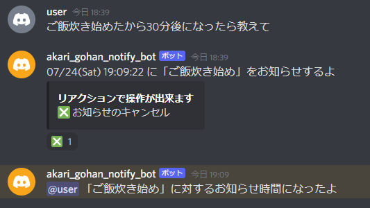

# akari_gohan_notify_bot
akari_gohan_notify_bot は Discord のテキストチャットで『（「何を」したから）「いつ」になったら「教えて」』というような入力をすると指定した時刻にメッセージと音声で通知をしてくれるbotです。</br>




## 出来ること
### テキストチャットによる通知の登録
テキストチャットに下記の通知登録のメッセージ例にあるような文を入力することで通知を登録出来ます。</br>
登録の詳細は [通知の登録方法](#通知の登録方法) を参照して下さい。</br>
登録に成功した場合、いつ通知をするかのメッセージが書き込まれます。</br>
</br>
通知登録のメッセージ例</br>
- ご飯炊き始めたから30分後になったら教えて
- ご飯炊き始めたから午後七時半になったら教えて
- カップ麺にお湯入れた。3分後になったら教えて。
- カレー煮込み始めたし一時間後になったら教えてほしい


### リアクションによる通知のキャンセル
通知の登録後に送られてくるメッセージのリアクションで通知を取り消すことが出来ます。</br>


### メンションおよび音声による通知
通知の時刻になるとメンション付きで時間になった旨を伝えるメッセージが送られてきます。</br>
また、通知の時刻に任意のボイスチャンネルに接続していると通知音声を再生するようになっています。</br>


## セットアップ方法
セットアップには以下の作業が必要です</br>
- Discord botアカウントの作成
- Discordサーバの設定
- bot起動用設定ファイル (config.json) 編集
- ボットの実行環境作成
- 通知用音声ファイル (notify.wav) の用意
- ffmpegのインストール


### Discord botアカウントの作成
1. 開発者サイトにログイン
	- Discord Developer Portal https://discordapp.com/developers/applications/
1. "Applications" タブの ”New Application" を選択しアプリケーションを作成、</br>
	"My Applications" から作成したアプリケーションを選択
	- "General Information" タブで以下の項目を設定
		- APP ICON：ボットのアイコン（設定は任意です）
		- NAME：ボットのユーザ名
	- "Bot" タブで "Add Bot" を選択、以下の項目を設定
		- PRESENCE INTENT：有効
		- SERVER MEMBERS INTENT：有効


### Discordサーバの設定
1. ボットアカウントの追加</br>
	1. "My Applications" から作成したアプリケーションの</br>
		"OAuth2" タブの "OAuth2 URL Generator" にある "bot" にチェックを入れ、下に表示されるURLをコピー
	1. コピーしたURLにアクセスし、"サーバーに追加" からボットを追加したいサーバを選択し "承認" を選択
1. ボットアカウントに "管理者" または以下の権限があるロールを付与
    - チャンネルを見る
	- メッセージを送信
	- メッセージの管理
	- メッセージ履歴を読む
	- リアクションの追加
	- すべてのロールにメンション
	- 接続
	- 発言


### bot起動用設定ファイル (config.json) 編集
config_template.json をコピーし名前を config.json に変更して以下の編集を行って下さい
- トークン (token)
	1. [開発者サイト](https://discordapp.com/developers/applications/) のボット用アプリケーション "Bot" タブの</br>
	"TOKEN" 項目にある "COPY" を選択（トークンは他人に知られないよう管理して下さい）
	1. "token" の行、 " " の""中にコピーしたトークン文字列を貼り付け
- bot反応テキストチャットのリスト (response_text_channel_id_list)
	1. botが反応するテキストチャンネルを右クリックして "IDをコピー" を選択
	1. "response_text_channel_id_list" の行、 [ ] の内側にコピーしたIDを貼り付け
		- 複数のテキストチャットで反応させたい場合 , で区切ってIDを貼り付けて下さい
			- [テキストチャンネルID_1, テキストチャンネルID_2, ... テキストチャンネルID_N]

<summary>config.json のサンプル</summary>

<pre>
{
    "token": "AbCD1EFgH2IKLm3nOPQ4RsTU.VWxYZ5.ABCd6eFGH7IjKL8MNOp9qRST_UvWX1YZ",
    "response_text_channel_id_list": [12345678901234567890, 12345678901234567891]
}
</pre>


### ボット動作環境作成
1. Python のインストール
	- Pythonのインストーラをダウンロードしインストール（本ボットは3.9.*系で動作確認しています）
		- インストールする際 "Add Python \*.\* to PATH" の項目にチェックを付けて下さい
		- Python公式 https://www.python.org/
1. pipenv のインストール
	- コマンドプロンプトやターミナルなどで ```pip install pipenv``` または ```pip3 install pipenv``` を実行
	- 環境変数 ```PIPENV_VENV_IN_PROJECT``` に ```true``` を設定
1. 実行に必要なパッケージのインストール
	- akari_gohan_notify_bot がある場所でコマンドプロンプトやターミナルなどを開き ```pipenv install``` を実行


### 通知用音声ファイル (notify.wav) の用意
通知の際に再生したい音声を用意し voice\notify.wav として配置して下さい。</br>


### ffmpegのインストール
ffmpeg をインストールし、環境変数 PATH に ffmpeg.exe のフォルダを追加して下さい。</br>


## ボットの起動方法
- akari_gohan_notify_bot がある場所でコマンドプロンプトやターミナルなどを開き ```pipenv run src\discord_bot.py``` を実行
	- ボットのアカウントがオンラインになればOK


## 通知の登録方法
『（「何を」したので）「いつ」になったら「教えて」』という形式でテキストチャンネルに入力すると通知が登録されます。</br>
通知の登録は入力文に「いつ」「教えて」の要素がある場合に実行されます。</br>
「何を」「いつ」「教えて」と判定される要素は以下の通りです。</br>
- 「何を」：文章の趣旨となるフレーズ
	- 趣旨となるフレーズが見つからない場合、「None」として扱われます
- 「いつ」：時刻、時間
	- 記述可能なフォーマットは [時刻時間表記](#時刻時間表記)、[時刻時間の表記例](#時刻時間の表記例) を参照して下さい
	- 記述可能なフォーマットで書いても正しく動作しない場合がありますので [注意点](#注意点) を参照して下さい
- 「教えて」：教えて、教えてに類する単語
	- 詳細は [教えてに類する単語](#教えてに類する単語) を参照して下さい


### 時刻時間表記
「時刻」「時間」の表記に関する定義は以下の通りです。</br>
具体例は [時刻時間の表記例](#時刻時間の表記例) に記述していますので合わせて参照して下さい</br>
- <時刻> = \[<午前午後>\], <数字>, <区切り>, <数字>, \[<区切り>\]
	- (*<午前午後> が省略された場合：登録タイミングから直近の表現として合う時刻として解釈します*)
- <時間> = \[<数字>, <区切り>\], \[<数字>, <区切り>\], \[<数字>, \[<区切り>\]\], "後"
	- (*<数字>, <区切り> は1回以上存在している必要があり、1回のみの場合 <区切り> は省略不可*)
- <数字> = { "0" | "1" | "2" | "3" | "4" | "5" | "6" | "7" | "8" | "9" | "9" | "０" | "１" | "２" | "３" | "４" | "５" | "６" | "７" | "８" | "９" | "〇" | "一" | "二" | "三" | "四" | "五" | "六" | "七" | "八" | "九" | "十" | "百" | "千" | "半" }
	- (*半 は 30 扱い*)
- <区切り> = "時" | "分" | "秒" | "時間" | ":" | "："
	- (*":" | "：" は [非推奨](#注意点)*)
- <午前午後> = "午前" | "午後" | "AM" | "PM" | "am" | "pm" | "A.M" | "P.M" | "a.m" | "p.m" | "A.M." | "P.M." | "a.m." | "p.m."

下記は簡略的に定義をまとめたものになります</br>
- 「時刻」＝「午前午後」「数字」「区切り」「数字」「区切り」
- 「時間」＝「数字」「区切り」後
	- 「数字」「区切り」は時、分、秒に合わせて繰り返し可能です
- 数字：半角(0123456789)、全角(０１２３４５６７８９)、漢数字（〇一二三四五六七八九十百千）、"半"（30扱い）
- 区切り：時、分、秒、時間、（[非推奨](#注意点)）:（半角、全角いずれも対応）
- 午前午後：午前、午後、AM、PM (AM, PMは大文字小文字、.付きいずれも対応)
	- 表記されていない場合：登録タイミングから直近の表現として合う時刻として解釈します


#### 時刻時間の表記例
以下は時刻、時間の書き方の一例です。</br>
[非推奨](#注意点) と書いている書き方は意図した時刻、時間になりにくい書き方です。</br>

時刻</br>
- 1時
- 1時2分
- 1時2分3秒
- 午前1時2分3秒
- 午後1時2分3秒
- 13時2分3秒
- 13:02 (非推奨)
- 13:02:03 (非推奨)
- 1時半
- 午前1:30
- AM1:30 (非推奨)

時間</br>
- 0時間00分03秒後
- 0時間02分00秒後
- 0時間02分03秒後
- 1時間00分00秒後
- 1時間00分03秒後
- 1時間02分00秒後
- 1時間02分03秒後
- 3秒後
- 2分後
- 2分3秒後
- 1時間後
- 1時間3秒後
- 1時間2分後
- 1時間2分3秒後
- 1時間半後
- 1分半後


### 教えてに類する単語
教えてに類する単語はインストールしている自然言語処理ライブラリや解析用辞書に依存します。</br>

動作テスト中に以下の単語が類する単語として判定されることを確認しています。</br>
- 知らせて
- 伝えて

他の単語でも類する単語として判定される可能性がありますが全てを確認することは現実的に難しい為、列挙は割愛します。</br>


## 注意点
文章の解析は自然言語処理ライブラリや解析用辞書に依存しています。</br>
全ての文章の書き方について動作テストすることは現実的に難しい為、具体的な列挙は極力割愛しています。</br>

### 時刻、時間を書く際 AM, PM, : を使うとでうまく反応しない場合がある
- "AM", "p.m" などの表記を使うと正しく判定しない場合があります
	- その場合、"午前", "午後" または24時間表記で入力して下さい

- 時分などを表現する際に : の表記を使うと正しく判定しない場合があります
	- その場合、"時", "分", "秒" で入力して下さい
	- 時刻の場合、"午前", "午後" を付けると比較的正しく反応します


### 一度botを停止させると登録していた通知予約が消える
登録した通知情報は外部に保存していない為botを停止させると通知情報は消えてしまします。</br>


## Links
### 使用ライブラリなどのライセンス
- discord.py</br>
Copyright (c) 2015-present Rapptz</br>
https://github.com/Rapptz/discord.py/blob/master/LICENSE</br>

- GiNZA</br>
Copyright (c) 2019 Megagon Labs</br>
https://github.com/megagonlabs/ginza/blob/develop/LICENSE</br>

- spaCy</br>
GiNZAはspaCyをNLP Frameworkとして使用しています。</br>
Copyright (C) 2016-2021 ExplosionAI GmbH, 2016 spaCy GmbH, 2015 Matthew Honnibal</br>
https://github.com/explosion/spaCy/blob/master/LICENSE</br>

- Sudachi / SudachiPy-SudachiDict-chiVe</br>
SudachiPy provides high accuracies for tokenization and pos tagging.</br>
https://github.com/WorksApplications/Sudachi/blob/develop/LICENSE-2.0.txt</br>
https://github.com/WorksApplications/SudachiPy/blob/develop/LICENSE</br>
https://github.com/WorksApplications/SudachiDict/blob/develop/LEGAL</br>
https://github.com/WorksApplications/chiVe/blob/master/LICENSE</br>

